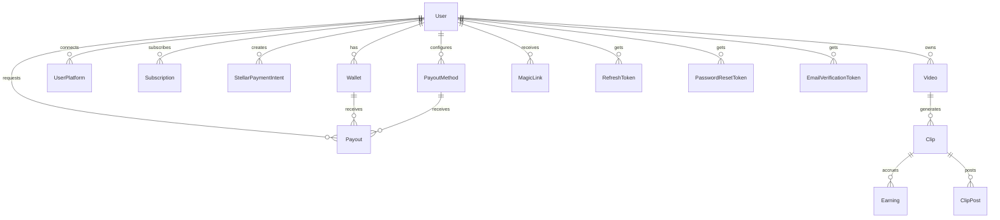

# Database Schema Reference

This document provides a detailed reference of the PostgreSQL database schema used by ClipCash, compiled from the Prisma ORM schema (`prisma/schema.prisma`).

---

## Entity-Relationship (ER) Diagram

The following diagram visualizes the relationships between the database tables.

---

## Detailed Model Reference

### 1. User
Core system users. Tracks credentials, authentication state, MFA settings, connected wallets, roles, and timestamps.

| Field | Type | Required? | Constraints & Defaults | Description |
|---|---|---|---|---|
| `id` | `Int` | Yes | `@id` `autoincrement()` | Primary key |
| `email` | `String` | Yes | `@unique` | Login email address |
| `password` | `String` | No | | Hashed password (null for OAuth-only users) |
| `mfaEnabled` | `Boolean` | Yes | `@default(false)` | Flag indicating if MFA is active |
| `mfaSecret` | `String` | No | | Encrypted MFA secret key |
| `provider` | `String` | No | | OAuth provider (e.g., `google`) |
| `providerId` | `String` | No | | Unique OAuth user ID |
| `name` | `String` | No | | User display name |
| `picture` | `String` | No | | URL to profile avatar image |
| `emailVerified` | `DateTime` | No | | Verification timestamp |
| `stellarPublicKey` | `String` | No | | Primary linked Stellar public key (legacy) |
| `walletType` | `String` | No | | Linked wallet type (legacy) |
| `encryptedStellarSecret` | `String` | No | | Encrypted fallback Stellar secret (legacy) |
| `role` | `String` | Yes | `@default("user")` | Access level role (`user`, `admin`) |
| `createdAt` | `DateTime` | Yes | `@default(now())` | Registration timestamp |
| `updatedAt` | `DateTime` | Yes | `@updatedAt` | Last modification timestamp |

*Unique constraint:* `@@unique([provider, providerId])`

---

### 2. Video
Source video uploads or platform imports owned by users.

| Field | Type | Required? | Constraints & Defaults | Description |
|---|---|---|---|---|
| `id` | `Int` | Yes | `@id` `autoincrement()` | Primary key |
| `userId` | `Int` | Yes | `@index` | Reference to `User.id` |
| `title` | `String` | No | | Video title |
| `description` | `String` | No | | Video description |
| `sourceType` | `String` | Yes | `@default("youtube")` | Source: `youtube`, `upload`, `tiktok`, `url` |
| `sourceUrl` | `String` | Yes | | Location URL of video file/import page |
| `thumbnail` | `String` | No | | Thumbnail image URL |
| `duration` | `Int` | No | | Video length in seconds |
| `fileSize` | `BigInt` | No | | Video file size in bytes |
| `status` | `String` | Yes | `@default("pending")` `@index` | Processing status: `pending`, `processing`, `completed`, `failed` |
| `processingError` | `String` | No | | Error details if processing failed |
| `processingStats` | `Json` | No | | Metadata processing statistics |
| `targetPlatforms` | `Json` | No | | Target networks for clips (e.g. `["tiktok"]`) |
| `createdAt` | `DateTime` | Yes | `@default(now())` | Import timestamp |
| `updatedAt` | `DateTime` | Yes | `@updatedAt` | Last update timestamp |

---

### 3. Clip
Short viral segments split from parent videos.

| Field | Type | Required? | Constraints & Defaults | Description |
|---|---|---|---|---|
| `id` | `Int` | Yes | `@id` `autoincrement()` | Primary key |
| `videoId` | `Int` | Yes | `@index` | Reference to `Video.id` |
| `clipUrl` | `String` | Yes | | Hosted video clip CDN URL (Cloudinary) |
| `thumbnail` | `String` | No | | Clip thumbnail image URL |
| `platform` | `String` | No | | Intended social platform (legacy) |
| `title` | `String` | No | | Custom title for social sharing |
| `caption` | `String` | No | | Caption/hashtags text |
| `startTime` | `Float` | Yes | | Start time offset relative to source video |
| `endTime` | `Float` | Yes | | End time offset relative to source video |
| `duration` | `Int` | Yes | | Clip duration in seconds |
| `viralityScore` | `Float` | No | | Predicted engagement score (0–100) |
| `royaltyBps` | `Int` | No | | Royalty basis points (e.g. `1000` = 10%) |
| `postStatus` | `Json` | No | | Multi-platform publishing logs |
| `postedAt` | `DateTime` | No | | Completion timestamp of posting |
| `metadataUri` | `String` | No | | IPFS metadata URL for NFT |
| `mintAddress` | `String` | No | `@unique` | Soroban token ID/address |
| `mintedAt` | `DateTime` | No | | Timestamp of ledger minting |
| `nftStatus` | `String` | Yes | `@default("none")` | NFT status: `none`, `pending`, `minted`, `failed` |
| `createdAt` | `DateTime` | Yes | `@default(now())` | Split creation timestamp |
| `updatedAt` | `DateTime` | Yes | `@updatedAt` | Last update timestamp |

---

### 4. ClipPost
Logs publishing actions for clips across social media platforms.

| Field | Type | Required? | Constraints & Defaults | Description |
|---|---|---|---|---|
| `id` | `Int` | Yes | `@id` `autoincrement()` | Primary key |
| `clipId` | `Int` | Yes | `@index` | Reference to `Clip.id` |
| `platform` | `String` | Yes | `@index` | Target platform (e.g., `tiktok`, `instagram`) |
| `status` | `String` | Yes | `@default("pending")` | Post status: `pending`, `posted`, `failed` |
| `postId` | `String` | No | | Native post ID returned by social networks |
| `attempts` | `Int` | Yes | `@default(0)` | Retry attempt count |
| `error` | `String` | No | | Failure message stack trace if posting failed |
| `createdAt` | `DateTime` | Yes | `@default(now())` | Request timestamp |
| `updatedAt` | `DateTime` | Yes | `@updatedAt` | Last status modification timestamp |

---

### 5. Earning
Tracks revenue items credited to creators from specific clips.

| Field | Type | Required? | Constraints & Defaults | Description |
|---|---|---|---|---|
| `id` | `Int` | Yes | `@id` `autoincrement()` | Primary key |
| `clipId` | `Int` | Yes | | Reference to `Clip.id` |
| `amount` | `Float` | Yes | | Total revenue accrued |
| `currency` | `String` | Yes | `@default("USD")` | Currency code |
| `date` | `DateTime` | Yes | | Earnings statement date |
| `source` | `String` | No | | Attributed source platform |
| `isAnomaly` | `Boolean` | Yes | `@default(false)` | Flag identifying suspicious earning spikes |
| `anomalyReason` | `String` | No | | Explanation reason for anomaly classification |
| `createdAt` | `DateTime` | Yes | `@default(now())` | Log timestamp |
| `deletedAt` | `DateTime` | No | | Soft-deletion timestamp |

---

### 6. UserPlatform
Tracks user OAuth connections to third-party social media profiles.

| Field | Type | Required? | Constraints & Defaults | Description |
|---|---|---|---|---|
| `id` | `Int` | Yes | `@id` `autoincrement()` | Primary key |
| `userId` | `Int` | Yes | | Reference to `User.id` |
| `platform` | `String` | Yes | | Social network identifier |
| `username` | `String` | No | | Social media username handle |
| `accessToken` | `String` | No | | OAuth access token |
| `refreshToken` | `String` | No | | OAuth refresh token |
| `connectedAt` | `DateTime` | Yes | `@default(now())` | Connection timestamp |
| `updatedAt` | `DateTime` | Yes | `@updatedAt` | Refresh timestamp |

---

### 7. Wallet
Registers Web3 wallet details linked to user profiles.

| Field | Type | Required? | Constraints & Defaults | Description |
|---|---|---|---|---|
| `id` | `Int` | Yes | `@id` `autoincrement()` | Primary key |
| `userId` | `Int` | Yes | `@index` | Reference to `User.id` |
| `address` | `String` | Yes | | Stellar public key (`G...`) |
| `chain` | `String` | Yes | `@default("stellar")` | Blockchain network code |
| `type` | `String` | Yes | | Wallet provider (e.g. `freighter`, `albedo`) |
| `connectedAt` | `DateTime` | Yes | `@default(now())` | Link timestamp |
| `updatedAt` | `DateTime` | Yes | `@updatedAt` | Update timestamp |
| `deletedAt` | `DateTime` | No | | Soft-deletion timestamp |

*Unique constraint:* `@@unique([address, chain])`

---

### 8. Payout
Payout requests processing accumulated creator earnings.

| Field | Type | Required? | Constraints & Defaults | Description |
|---|---|---|---|---|
| `id` | `Int` | Yes | `@id` `autoincrement()` | Primary key |
| `userId` | `Int` | Yes | | Reference to `User.id` |
| `walletId` | `Int` | No | | Reference to `Wallet.id` (for Stellar payouts) |
| `payoutMethodId` | `Int` | No | `@index` | Reference to `PayoutMethod.id` (for bank payouts) |
| `amount` | `Float` | Yes | | Gross payout amount in USD |
| `currency` | `String` | Yes | `@default("USD")` | USD denomination |
| `method` | `String` | Yes | | Channel type: `stellar`, `bank_wire` |
| `status` | `String` | Yes | `@index` | Status: `pending`, `processing`, `completed`, `failed`, `rejected` |
| `transactionId` | `String` | No | | Internal payment system identifier |
| `stellarXdr` | `String` | No | | Raw transaction envelope XDR |
| `onChainTxHash` | `String` | No | | Confirmed on-chain transaction hash |
| `confirmedAt` | `DateTime` | No | | Ledger execution confirmation timestamp |
| `paidAt` | `DateTime` | No | | Transfer execution timestamp |
| `approvedAt` | `DateTime` | No | | Manual admin approval timestamp |
| `rejectedAt` | `DateTime` | No | | Rejection timestamp |
| `rejectionReason` | `String` | No | | Reason explanation for payout rejection |
| `feeAmount` | `Float` | No | | Calculated processing fee |
| `feePercentage` | `Float` | No | | Applied percentage rate |
| `finalAmount` | `Float` | No | | Net payout amount received |
| `retryCount` | `Int` | Yes | `@default(0)` | Retries attempted on blockchain errors |
| `lastAttemptAt` | `DateTime` | No | | Last transaction attempt timestamp |
| `createdAt` | `DateTime` | Yes | `@default(now())` | Request timestamp |
| `updatedAt` | `DateTime` | Yes | `@updatedAt` | Last modification timestamp |

---

### 9. Subscription
Tracks premium account plans.

| Field | Type | Required? | Constraints & Defaults | Description |
|---|---|---|---|---|
| `id` | `Int` | Yes | `@id` `autoincrement()` | Primary key |
| `userId` | `Int` | Yes | | Reference to `User.id` |
| `plan` | `String` | Yes | | Selected tier: `basic`, `pro`, `enterprise` |
| `status` | `String` | Yes | | Billing status: `active`, `canceled`, `past_due` |
| `paymentMethod` | `String` | Yes | `@default("stripe")` | Gateway: `stripe`, `stellar` |
| `startDate` | `DateTime` | Yes | | Plan coverage start date |
| `endDate` | `DateTime` | No | | Plan coverage end date |
| `stellarTxHash` | `String` | No | | On-chain hash if paid with crypto |
| `stellarMemo` | `String` | No | | Matching memo identifying payment on-chain |
| `createdAt` | `DateTime` | Yes | `@default(now())` | Purchase timestamp |
| `updatedAt` | `DateTime` | Yes | `@updatedAt` | Last status modification timestamp |

---

### 10. StellarPaymentIntent
Pending Web3 payments generated to subscribe via Stellar XLM/USDC.

| Field | Type | Required? | Constraints & Defaults | Description |
|---|---|---|---|---|
| `id` | `String` | Yes | `@id` `default(cuid())` | Unique intent ID (CUID) |
| `userId` | `Int` | Yes | | Reference to `User.id` |
| `amount` | `Float` | Yes | | Required transfer amount |
| `asset` | `String` | Yes | | Stellar asset code (`XLM`, `USDC`) |
| `destination` | `String` | Yes | | Target platform receiving address |
| `memo` | `String` | Yes | | Unique memo to isolate incoming transaction |
| `status` | `String` | Yes | `@default("pending")` | Status: `pending`, `completed`, `expired` |
| `expiresAt` | `DateTime` | Yes | | Expiry time (+15 mins from intent generation) |
| `transactionId` | `String` | No | | Matching transaction on-chain hash |
| `plan` | `String` | Yes | | targeted subscription plan ID |
| `createdAt` | `DateTime` | Yes | `@default(now())` | Intent issue timestamp |
| `updatedAt` | `DateTime` | Yes | `@updatedAt` | Status modification timestamp |

---

### 11. MagicLink
Single-use secure passwordless login tokens.

| Field | Type | Required? | Constraints & Defaults | Description |
|---|---|---|---|---|
| `id` | `Int` | Yes | `@id` `autoincrement()` | Primary key |
| `userId` | `Int` | Yes | | Reference to `User.id` |
| `tokenHash` | `String` | Yes | `@unique` `@index` | SHA-256 hash of plaintext token |
| `expiresAt` | `DateTime` | Yes | | Link expiry time |
| `usedAt` | `DateTime` | No | | Consumption timestamp |
| `createdAt` | `DateTime` | Yes | `@default(now())` | Issue timestamp |

---

### 12. RefreshToken
Persistent session identifiers used to refresh auth JWT tokens.

| Field | Type | Required? | Constraints & Defaults | Description |
|---|---|---|---|---|
| `id` | `Int` | Yes | `@id` `autoincrement()` | Primary key |
| `userId` | `Int` | Yes | `@index` | Reference to `User.id` |
| `tokenHash` | `String` | Yes | `@unique` | SHA-256 hash of refresh token |
| `expiresAt` | `DateTime` | Yes | | Token expiry timestamp |
| `revokedAt` | `DateTime` | No | | Explicit revocation timestamp |
| `userAgentHash` | `String` | No | | Hashed client browser/User-Agent |
| `ipAddress` | `String` | No | | IP address registering creation |
| `acceptLanguage` | `String` | No | | Client locale language |
| `createdAt` | `DateTime` | Yes | `@default(now())` | Token creation timestamp |

---

### 13. PasswordResetToken
Single-use security verification tokens for password recovery.

| Field | Type | Required? | Constraints & Defaults | Description |
|---|---|---|---|---|
| `id` | `Int` | Yes | `@id` `autoincrement()` | Primary key |
| `userId` | `Int` | Yes | `@index` | Reference to `User.id` |
| `tokenHash` | `String` | Yes | `@unique` `@index` | SHA-256 token hash |
| `expiresAt` | `DateTime` | Yes | | Expiration timestamp |
| `usedAt` | `DateTime` | No | | Consumption timestamp |
| `createdAt` | `DateTime` | Yes | `@default(now())` | Generation timestamp |

---

### 14. EmailVerificationToken
Single-use secure tokens for user registration email confirmation.

| Field | Type | Required? | Constraints & Defaults | Description |
|---|---|---|---|---|
| `id` | `Int` | Yes | `@id` `autoincrement()` | Primary key |
| `userId` | `Int` | Yes | `@index` | Reference to `User.id` |
| `tokenHash` | `String` | Yes | `@unique` `@index` | SHA-256 token hash |
| `expiresAt` | `DateTime` | Yes | | Expiration timestamp |
| `usedAt` | `DateTime` | No | | Consumption timestamp |
| `createdAt` | `DateTime` | Yes | `@default(now())` | Generation timestamp |

---

### 15. StellarWebhookLog
Logs processed transactions from Stellar blockchain endpoints to ensure payment event idempotent operations.

| Field | Type | Required? | Constraints & Defaults | Description |
|---|---|---|---|---|
| `id` | `Int` | Yes | `@id` `autoincrement()` | Primary key |
| `transactionId` | `String` | Yes | `@unique` `@index` | Transaction hash |
| `payload` | `String` | Yes | | Raw transaction payload body |
| `processedAt` | `DateTime` | Yes | `@default(now())` `@index` | Entry audit timestamp |

---

### 16. PayoutFeeConfig
Fee charging structures mapped by payout channel methods.

| Field | Type | Required? | Constraints & Defaults | Description |
|---|---|---|---|---|
| `id` | `Int` | Yes | `@id` `autoincrement()` | Primary key |
| `method` | `String` | Yes | `@unique` | Method code: `stellar`, `bank_wire` |
| `feePercentage` | `Float` | Yes | | Applied percentage rate (e.g. `1.5` = 1.5%) |
| `fixedFee` | `Float` | Yes | `@default(0)` | Fixed surcharge fee in USD |
| `minFee` | `Float` | Yes | `@default(0)` | Minimum fee floor in USD |
| `maxFee` | `Float` | No | | Maximum fee cap in USD |
| `isActive` | `Boolean` | Yes | `@default(true)` | Toggle switch configuration state |
| `createdAt` | `DateTime` | Yes | `@default(now())` | Setup timestamp |
| `updatedAt` | `DateTime` | Yes | `@updatedAt` | Last modification timestamp |

---

### 17. PlatformWebhookLog
Logs webhooks from third-party publishing platforms (e.g., Ayrshare).

| Field | Type | Required? | Constraints & Defaults | Description |
|---|---|---|---|---|
| `id` | `Int` | Yes | `@id` `autoincrement()` | Primary key |
| `platform` | `String` | Yes | `@index` | Platform code name |
| `eventType` | `String` | Yes | | Trigger event name |
| `payload` | `String` | Yes | | Raw JSON webhook payload string |
| `signature` | `String` | No | | incoming payload validation signature |
| `isValid` | `Boolean` | Yes | `@default(false)` | Flag indicating verification validation state |
| `processedAt` | `DateTime` | Yes | `@default(now())` `@index` | Webhook receipt timestamp |
| `error` | `String` | No | | Failure message if parsing/verifying failed |

---

### 18. AnomalyAlert
Auditing logs alerting administrators of suspicious earning spikes or fraud flags.

| Field | Type | Required? | Constraints & Defaults | Description |
|---|---|---|---|---|
| `id` | `Int` | Yes | `@id` `autoincrement()` | Primary key |
| `earningId` | `Int` | Yes | | Reference to `Earning.id` |
| `userId` | `Int` | Yes | `@index` | Reference to `User.id` |
| `amount` | `Float` | Yes | | Earnings total flagged |
| `reason` | `String` | Yes | | Rule violation description |
| `severity` | `String` | Yes | | Threat level: `low`, `medium`, `high` |
| `isResolved` | `Boolean` | Yes | `@default(false)` `@index` | Resolution status |
| `resolvedAt` | `DateTime` | No | | Resolution timestamp |
| `createdAt` | `DateTime` | Yes | `@default(now())` `@index` | Alert creation timestamp |

---

### 19. PayoutMethod
Secured bank routing coordinates for fiat payouts.

| Field | Type | Required? | Constraints & Defaults | Description |
|---|---|---|---|---|
| `id` | `Int` | Yes | `@id` `autoincrement()` | Primary key |
| `userId` | `Int` | Yes | `@index` | Reference to `User.id` |
| `type` | `String` | Yes | `@index` | Transfer type: `bank_wire`, `ach`, `sepa` |
| `isDefault` | `Boolean` | Yes | `@default(false)` | Default routing selection flag |
| `encryptedAccountNumber` | `String` | No | | Encrypted account number string |
| `encryptedRoutingNumber` | `String` | No | | Encrypted bank routing number string |
| `encryptedSwiftCode` | `String` | No | | Encrypted SWIFT bank code |
| `encryptedIban` | `String` | No | | Encrypted international IBAN code |
| `bankName` | `String` | No | | Bank routing name |
| `accountHolderName` | `String` | No | | Recipient client name |
| `country` | `String` | No | | Bank registration country code |
| `currency` | `String` | Yes | `@default("USD")` | USD/fiat currency indicator |
| `lastFourDigits` | `String` | No | | Masked security reference code (last 4 digits) |
| `createdAt` | `DateTime` | Yes | `@default(now())` | Method setup timestamp |
| `updatedAt` | `DateTime` | Yes | `@updatedAt` | Modification timestamp |
| `deletedAt` | `DateTime` | No | | Soft-deletion timestamp |

---

### 20. MonthlyEarning
Monthly aggregated earnings reports populated by background processors.

| Field | Type | Required? | Constraints & Defaults | Description |
|---|---|---|---|---|
| `id` | `Int` | Yes | `@id` `autoincrement()` | Primary key |
| `userId` | `Int` | Yes | `@index` | Reference to `User.id` |
| `year` | `Int` | Yes | `@index` | Aggregated statement year |
| `month` | `Int` | Yes | `@index` | Aggregated statement month (1-12) |
| `totalAmount` | `Float` | Yes | | Total earnings accumulated in USD |
| `currency` | `String` | Yes | `@default("USD")` | Default USD currency code |
| `platformBreakdown` | `Json` | No | | Breakdown by platform, e.g. `{"youtube":10.5}` |
| `createdAt` | `DateTime` | Yes | `@default(now())` | Record aggregation timestamp |
| `updatedAt` | `DateTime` | Yes | `@updatedAt` | Aggregator update timestamp |

*Unique constraint:* `@@unique([userId, year, month])`

---

## Relationships & Cascading Constraints

All relationships enforce referential integrity using PostgreSQL foreign keys. Cascading deletes (`onDelete: Cascade`) are configured on user-owned assets to clean up child dependencies automatically:

*   **User -> Video**: 1:N with `onDelete: Cascade`. Deleting a user deletes all their video metadata.
*   **Video -> Clip**: 1:N with `onDelete: Cascade`. Deleting a video cleans up all generated segments.
*   **Clip -> ClipPost**: 1:N with `onDelete: Cascade`. Deleting a clip cleans up posting try logs.
*   **Clip -> Earning**: 1:N with `onDelete: Cascade`.
*   **User -> Subscription**: 1:N with `onDelete: Cascade`.
*   **User -> Wallet**: 1:N with `onDelete: Cascade`.
*   **User -> UserPlatform**: 1:N with `onDelete: Cascade`.
*   **User -> Payout**: 1:N with `onDelete: Cascade`.
*   **User -> PayoutMethod**: 1:N with `onDelete: Cascade`.
*   **User -> MagicLink**: 1:N with `onDelete: Cascade`.
*   **User -> RefreshToken**: 1:N with `onDelete: Cascade`.
*   **User -> PasswordResetToken**: 1:N with `onDelete: Cascade`.
*   **User -> EmailVerificationToken**: 1:N with `onDelete: Cascade`.

Standard relations (e.g. `Payout -> Wallet` and `Payout -> PayoutMethod`) use non-cascading relations to preserve audit payout history records if a method or wallet is deleted or disconnected.

---

## Indexing Strategy

Indexing is applied to query-critical constraints and foreign key fields to optimize select execution times:

1.  **Unique constraints for fast lookups**:
    *   `User(email)`
    *   `Wallet(address, chain)`
    *   `MonthlyEarning(userId, year, month)`
    *   `MagicLink / RefreshToken / PasswordResetToken / EmailVerificationToken (tokenHash)`
    *   `StellarWebhookLog (transactionId)`
    *   `PayoutFeeConfig (method)`
2.  **Performance indexes for filtering**:
    *   `Video(userId)`, `Video(status)`
    *   `Clip(videoId)`
    *   `ClipPost(clipId)`, `ClipPost(platform)`
    *   `Wallet(userId)`
    *   `Payout(payoutMethodId)`, `Payout(status)`
    *   `RefreshToken(userId)`
    *   `MonthlyEarning(userId)`, `MonthlyEarning(year, month)`
    *   `AnomalyAlert(userId)`, `AnomalyAlert(isResolved)`, `AnomalyAlert(createdAt)`
    *   `PayoutMethod(userId)`, `PayoutMethod(type)`
    *   `PlatformWebhookLog(platform)`, `PlatformWebhookLog(processedAt)`
